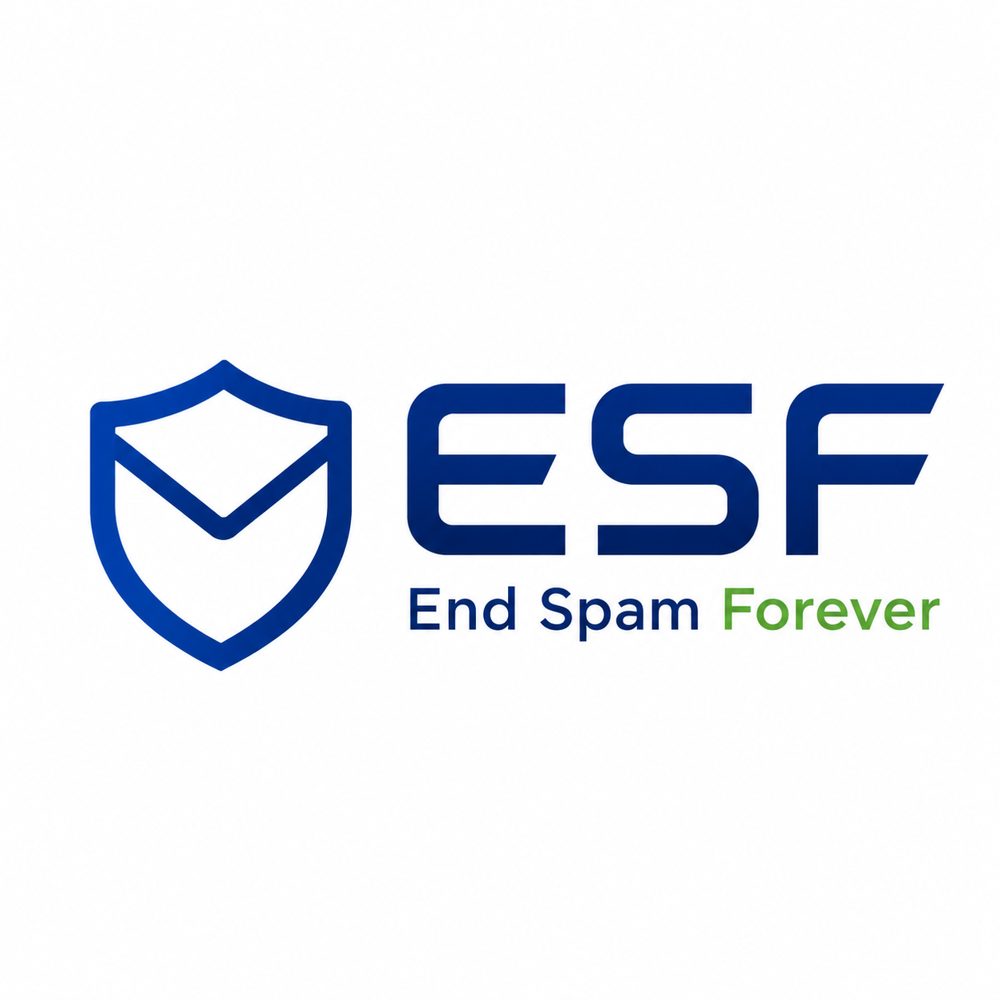

<p align="center"></p>

# End Spam Forever (ESF)

ESF – End Spam Forever aims to make email spam economically unviable through Proof-of-Work. It is an open-source
framework with integrations for multiple email clients and servers, a vendor-neutral protocol specification, an RFC
proposal, and a technical whitepaper.

> A valid ESF stamp proves that a sender spent measurable computing time for one specific recipient. It is a
> scarce-resource signal — not sender authentication, not a reputation score, and not a verdict on content. ESF
> complements SPF, DKIM and DMARC rather than replacing them.

## Download

Both clients are published as installable packages with every release:

| | Package | Install |
|---|---|---|
| **Thunderbird** | `esf-thunderbird-<version>.xpi` | Add-ons Manager → gear → *Install Add-on From File*. Thunderbird 128+; verified on 153. Unsigned, so `xpinstall.signatures.required = false` is needed. |
| **Outlook** | `esf-outlook-<version>.zip` | Serve `web/` over HTTPS, set that URL in `manifest.xml`, install the manifest. `INSTALL.md` in the archive covers sideloading and admin deployment. Requirement set 1.12+; no Outlook mobile. |

### → [Latest release](https://github.com/sprajcpf/esf/releases/latest)

Both clients carry the same version number when they do the same thing, so `0.7.0` in Thunderbird and `0.7.0` in
Outlook behave alike. The text ESF puts into a message - the footer and the note to a sender who has no stamp - is
written in German for a German mail client and in English for every other language.

Prototype quality: a stamp proves computing time was spent for a recipient, and nothing else. Read
[SECURITY.md](SECURITY.md) before relying on it.

## Documentation

| Document | |
|---|---|
| [Technical Whitepaper (Markdown)](docs/ESF_End_Spam_Forever_Technical_Whitepaper.md) | **Canonical source.** Problem, prior art, architecture, the ESF-Stamp protocol, work profiles, policy, threat model, roadmap, RFC path, and Appendix D with the reference-client learnings |
| [Technical Whitepaper (HTML)](docs/ESF_End_Spam_Forever_Technical_Whitepaper.html) | Rendered for reading and printing |
| [Technical Whitepaper (ODT)](docs/ESF_End_Spam_Forever_Technical_Whitepaper.odt) | Rendered as an editable ODF text document |
| [Technical Whitepaper (DOCX)](docs/ESF_End_Spam_Forever_Technical_Whitepaper.docx) | Rendered as a Word document |
| [Adoption Roadmap](docs/ESF_End_Spam_Forever_Adoption_Roadmap.md) ([HTML](docs/ESF_End_Spam_Forever_Adoption_Roadmap.html), [ODT](docs/ESF_End_Spam_Forever_Adoption_Roadmap.odt), [DOCX](docs/ESF_End_Spam_Forever_Adoption_Roadmap.docx)) | How ESF gets from working prototype to ecosystem adoption: ordered stages with explicit exit criteria, no dates |
| [Prior Art](docs/prior-art.md) ([HTML](docs/prior-art.html), [ODT](docs/prior-art.odt), [DOCX](docs/prior-art.docx)) | **Markdown source.** Long-form historical analysis: computational postage from Dwork/Naor and Hashcash through Camram, Penny Black and the integrations that shipped, the published criticism of the idea, and what it leaves unanswered |

All renders are generated from the Markdown and then checked against it, dependency-free:
`cd clients/thunderbird && npm run docs`. The check compares headings, tables, code blocks and key
wording, so a format cannot silently drift out of sync again.

## Prior art

Computational postage for email is old ground, and ESF stands on it: Dwork and Naor's *Pricing via Processing or
Combatting Junk Mail* (1992), Adam Back's Hashcash (announced 1997 and, by Back's own account, developed without
knowledge of the Dwork/Naor paper — an independent rediscovery rather than a descendant), Eric S. Johansson's Camram,
and Microsoft Research's Penny Black project. Hashcash also reached real mail software: Apache SpamAssassin shipped a
verifying plugin with double-spend tracking for years, and the PennyPost extension minted stamps inside Thunderbird.

ESF does not claim to have invented proof of work for email. It is a modern, interoperable, receiver-policy-driven
implementation, aimed at the deployment, interoperability, usability and algorithm-agility problems that kept the
earlier systems from broad adoption.

The main published criticism is Laurie and Clayton's
[*"Proof-of-Work" Proves Not to Work*](https://www.cl.cam.ac.uk/~rnc1/proofwork2.pdf) (2004), which concluded that a
difficulty high enough to deter spammers would also price out a material share of legitimate senders. The whitepaper
answers it in the open, including the parts it cannot answer.

Long-form history, sources and criticism: [docs/prior-art.md](docs/prior-art.md). The short version is
[section 2 of the whitepaper](docs/ESF_End_Spam_Forever_Technical_Whitepaper.md#2-prior-art).

## Clients

| Client | Status | Summary |
|---|---|---|
| [Thunderbird](clients/thunderbird/) | Working prototype — MailExtension, Manifest V3, Thunderbird 128+, verified on 153 | Mints one stamp per recipient in `compose.onBeforeSend`, verifies on display, traffic light on the message button, 148 unit tests |
| [Outlook](clients/outlook/) | Working prototype — Office.js add-in, Mailbox 1.12+ (Web, new and classic Windows, Mac) | Mints stamps in `OnMessageSend` before Outlook releases the mail, reads stamps from the internet-header block, traffic light in the task pane, 22 unit tests |

Both clients run the **same protocol core** — `clients/thunderbird/src/protocol/`, which is free of any client API
usage — and both check the same [test vectors](clients/thunderbird/test/vectors.json), so a stamp minted by one
verifies in the other. The whitepaper asks for exactly that (section 4.1): one reusable core and one set of vectors
for every client, gateway and filter, with no client-specific protocol variants.

Platform notes worth knowing before picking a client: Outlook's send hook needs Mailbox requirement set 1.12, is not
available on Outlook mobile at all, and the automatic variant needs admin deployment; classic Outlook on Windows runs
event handlers in a JavaScript-only runtime, so that entry point ships as a self-contained bundle. Thunderbird has no
such restriction, but folds all stamps of a message into one header field because its `customHeaders` API keeps only
one field per name. Details are in each client's README and in the whitepaper's Appendix D.

## The stamp in one glance

```text
X-ESF-Stamp: v=1; alg=sha256; d=22; t=1787651400; sid=…; rid=…; mid=…; salt=…; nonce=19d82c

work  = UTF8("ESF1\n" + "alg=sha256\n" + "d=…\n" + "t=…\n" + "sid=…\n" + "rid=…\n" + "mid=…\n" +
             "salt=…\n" + "nonce=…\n")
valid iff leading_zero_bits(SHA256(work)) >= d
```

`sid`, `rid` and `mid` are salted BASE64URL digests binding the stamp to the sender, to one recipient and to the
message, so no mailbox appears in clear text. Generating a 22-bit stamp costs about 4.2 million hashes; verifying one
costs exactly one hash, whatever the sender declares. That asymmetry is the whole mechanism.

## Contributing and security

Read [CONTRIBUTING.md](CONTRIBUTING.md) before opening a pull request — it lists the six non-negotiables (the
protocol core stays free of client APIs, the test vectors are the contract, a missing stamp stays neutral, no central
ESF service, no dependencies in the core, and proof of work never claims to authenticate anyone), the commands, and
what kinds of contribution help most.

Found a way to make a verifier accept work that was not done? [SECURITY.md](SECURITY.md) explains how to report it,
distinguishes an implementation flaw from a **protocol** flaw, and lists the known limitations and non-issues so you
do not spend time on something already documented.

## Licence

Apache-2.0.
